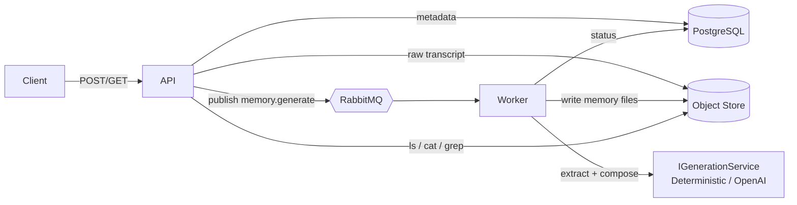

# MemoryWiki

> Ingest conversation transcripts → generate structured **memories** with an LLM →
> store them as a navigable file tree in object storage → browse them with unix-style
> `ls` / `cat` / `grep` REST endpoints.

Built with **.NET 8**, Clean Architecture + DDD + CQRS, PostgreSQL, RabbitMQ, an
S3-compatible object store (MinIO), and a provider-agnostic LLM layer. **Runs locally
with a single command and zero API keys** (deterministic offline generator), or with
OpenAI by setting one variable.

```bash
cp .env.example .env && docker compose up --build
# then:  ./scripts/demo.sh   (or  pwsh ./scripts/demo.ps1)
```

Full instructions: **[SETUP.md](SETUP.md)** · Diagrams: **[docs/ARCHITECTURE.md](docs/ARCHITECTURE.md)** · API: **[docs/API.md](docs/API.md)**

---

## 1. What it does

1. `POST /api/transcripts` — accepts a transcript (multipart), stores the raw text in the
   object store, persists metadata in Postgres, creates a **ProcessingJob**, and publishes
   a `memory.generate` message to RabbitMQ. Returns immediately (`202`-style: `Queued`).
2. The **Worker** consumes the message and runs a two-pass pipeline:
   **extract** structured entities → **compose/merge** one markdown file per entity →
   write to object storage → update Postgres → publish `memory.completed`.
3. `GET /api/memory/ls|cat|grep` — browse the resulting memory tree.

---

## 2. Architecture at a glance



Clean Architecture dependency rule (inward only):

```
Api ─┐
Worker ─┼─► Application ─► Domain
Infrastructure ─┘   (implements Application's ports)
Contracts / Shared  (cross-cutting DTOs, messages, Result)
```

- **Domain** — entities (`Transcript`, `ProcessingJob`, `MemoryDocument`), value objects
  (`MemoryPath`, `PersonName`…), enums, domain events. No framework dependencies.
- **Application** — CQRS handlers (MediatR), validators (FluentValidation), and **ports**
  (`IObjectStorage`, `IGenerationService`, `IMessagePublisher`, repositories).
- **Infrastructure** — EF Core/Npgsql, S3 storage, RabbitMQ, Prompt builder + LLM adapters.
- **Api** — minimal APIs, JWT auth, rate limiting, Swagger, health, OpenTelemetry.
- **Worker** — `BackgroundService` RabbitMQ consumer that dispatches the generation command.

---

## 3. Memory design (the core of the evaluation)

### File tree & naming
```
/people/<slug>.md      e.g. /people/alice.md          (one file per person)
/projects/<slug>.md    e.g. /projects/memorywiki-project-kickoff.md
/topics/<slug>.md      e.g. /topics/queue-migration.md
/events/<slug>.md
```
- **Entity = file.** Each durable entity (a person, a project, a topic, an event) gets its
  own stable, slugged markdown file. Slugs are deterministic (`EntityName.Slugify`) so the
  same entity always maps to the same path → updates are addressable.
- **Object key == path** (minus leading `/`), so the object store *is* the file tree. `ls`
  uses S3 delimiter listing; `cat` is a `GetObject`; `grep` scans `.md` objects.
- A Postgres `memory_documents` index row mirrors each file for fast listing, versioning
  and soft-delete (the object store remains the source of truth for content).

### What goes in each file
A **Person** file: `Summary, Responsibilities, Meetings, Projects, Important Decisions,
Relationships, Open Questions`.
A **Project/Topic/Event** file: `Summary, Participants, Timeline, Important Facts,
Decisions, Open Questions, Related Topics`.
Each file ends with a provenance comment: `<!-- sources: <transcript titles> -->`.

### How new transcripts interact with existing memory — **merge, not overwrite**
The pipeline is deliberately two-pass:
1. **Extract** (`IGenerationService.ExtractAsync`) → structured entities + atomic facts.
2. **Compose/merge** (`ComposeMarkdownAsync`) → for each entity we **load the existing
   file** (if any) and merge: prior bullet facts are preserved, new ones appended,
   duplicates removed, provenance accumulated. Unchanged content is detected by hash and
   skipped (no version churn). See `MarkdownMerger` (pure + unit-tested).

This makes memory **cumulative**: the wiki gets richer with every transcript, and `grep`
stays useful because facts are atomic bullets with stable headings.

---

## 4. Background processing: reliability, retries, idempotency

- **At-least-once** delivery with **manual acks**.
- **Idempotency:** one `ProcessingJob` per transcript. A redelivered message whose job
  already `Succeeded` is a no-op. Per-entity hash checks make re-writes idempotent too.
- **Retries:** failures are requeued with a short backoff up to `MaxAttempts` (5), tracked
  on the job (`Attempts`). Exhausted jobs are marked `DeadLettered` and routed to the
  **DLQ** (`memory.generate.dlq`) via a dead-letter exchange. Poison/unparseable messages
  dead-letter immediately.
- **Backpressure:** `BasicQos` prefetch bounds in-flight work per worker; KEDA scales
  workers on queue depth in Kubernetes.

---

## 5. Testing pyramid

| Level | Project | Covers |
|-------|---------|--------|
| Unit | `Application.Tests` | `MemoryPath` traversal guards, `MarkdownMerger` merge/dedup, deterministic extraction, `CreateTranscript` & `GenerateMemory` handlers (idempotency) with fakes/mocks |
| Integration | `Integration.Tests` | Real PostgreSQL via **Testcontainers** — migration applies, repository round-trip, unique-job constraint |
| E2E | `scripts/demo.sh` / `demo.ps1` | Full stack over docker-compose: auth → upload → poll → ls/cat/grep |

```bash
dotnet test MemoryWiki.sln
```

---

## 6. Security

- **JWT Bearer** auth (HS256); role-based policies (`Admin`, `User`). Demo users seeded
  from config — swap `TokenService` for OIDC in production.
- **Input validation** (FluentValidation) on every command; **path traversal** blocked in
  `MemoryPath.Normalize`; regex `grep` falls back to literal on invalid patterns.
- **Upload limits** (5 MB) enforced at form options + validator.
- **Rate limiting** (fixed-window per user/IP).
- **Virus-scan hook** is an explicit extension point (documented as future work below).
- Secrets via env/K8s secrets; nothing sensitive committed (`.env` is git-ignored).

---

## 7. Observability

- **Serilog** structured logging (console / JSON-ready).
- **OpenTelemetry** tracing + metrics (ASP.NET Core + HttpClient); OTLP exporter when
  `OTEL_EXPORTER_OTLP_ENDPOINT` is set, otherwise console.
- **Health checks**: `/api/health` (liveness) and `/api/health/ready` (Postgres readiness).

---

## 8. Assumptions

- Transcripts are UTF-8 text (speaker-labelled lines like `Alice: …` are exploited by the
  offline generator, but free-form text also works).
- A single logical tenant by default; multi-tenant isolation is implemented via an
  optional `tenant` claim / `X-Tenant-Id` header that prefixes object keys and DB rows.
- "Cloud storage" is satisfied by any S3-compatible store; MinIO locally, AWS S3 in prod.

---

## 9. Tradeoffs considered

- **Object store as source of truth + DB index** vs. DB-only. Chose the former: the tree
  *is* the storage (faithful to the brief) while the index keeps `ls`/versioning fast.
- **Two-pass LLM (extract → compose)** vs. single mega-prompt. Two passes give clean,
  per-file deterministic merges and far better idempotency/diffing, at the cost of more
  model calls. Worth it for update correctness.
- **Deterministic offline generator** shipped alongside OpenAI so the project satisfies
  "runs with a single command" with **no keys**, and so tests are hermetic. It trades LLM
  nuance for reproducibility; OpenAI is one env var away.
- **`grep` scans objects at query time** (simple, always correct) vs. a search index. Fine
  at this scale; pgvector/OpenSearch noted below for growth.
- **Auto-migrate on startup** for one-command UX vs. a separate migration job (safer for
  multi-replica prod — noted below).

## 10. What I'd do with more time

- **Semantic search** with PostgreSQL **pgvector** (embeddings) + hybrid grep/vector rank.
- **Transactional outbox** for the `memory.generate` publish (today it's publish-after-commit;
  an outbox removes the small dual-write window).
- **Memory versioning UI + diff** (data model already versions + soft-deletes).
- **SignalR** progress streaming + streaming LLM responses.
- **Graph relationships** between entities (people ↔ projects ↔ events) and a `/graph` API.
- **Virus scanning** (ClamAV) behind the existing upload hook; resumable large uploads.
- **Api.Tests** with `WebApplicationFactory` over a Testcontainers-backed host (e2e in CI).
- Separate **migration job** + readiness gating for safe multi-replica rollouts.

---

## 11. Folder structure
```
src/
  MemoryWiki.Domain          # entities, value objects, enums, events, repo interfaces
  MemoryWiki.Application      # CQRS handlers, validators, ports (interfaces), behaviors
  MemoryWiki.Infrastructure   # EF Core, S3 storage, RabbitMQ, PromptBuilder, LLM adapters, migrations
  MemoryWiki.Contracts        # transport DTOs + queue messages (CloudEvents-shaped)
  MemoryWiki.Shared           # Result<T>, Error, tree/messaging constants
  MemoryWiki.Api              # minimal APIs, JWT, rate limiting, Swagger, health, OTel
  MemoryWiki.Worker           # RabbitMQ BackgroundService consumer
tests/
  MemoryWiki.Application.Tests    # unit
  MemoryWiki.Integration.Tests    # Testcontainers (Postgres)
deploy/helm/memorywiki        # K8s chart + HPA + KEDA
scripts/                      # demo.sh / demo.ps1 / sample-transcript.txt
docs/                         # ARCHITECTURE.md, API.md
```

## 12. Tech stack
.NET 8 · ASP.NET Core Minimal APIs · MediatR · FluentValidation · Mapster · EF Core +
Npgsql · RabbitMQ.Client · AWS SDK for S3 (MinIO) · Polly · JWT Bearer · Serilog ·
OpenTelemetry · Swagger/OpenAPI · xUnit · FluentAssertions · Moq · Testcontainers ·
Docker Compose · GitHub Actions · Helm + KEDA.

## License
MIT (sample/assignment code).
