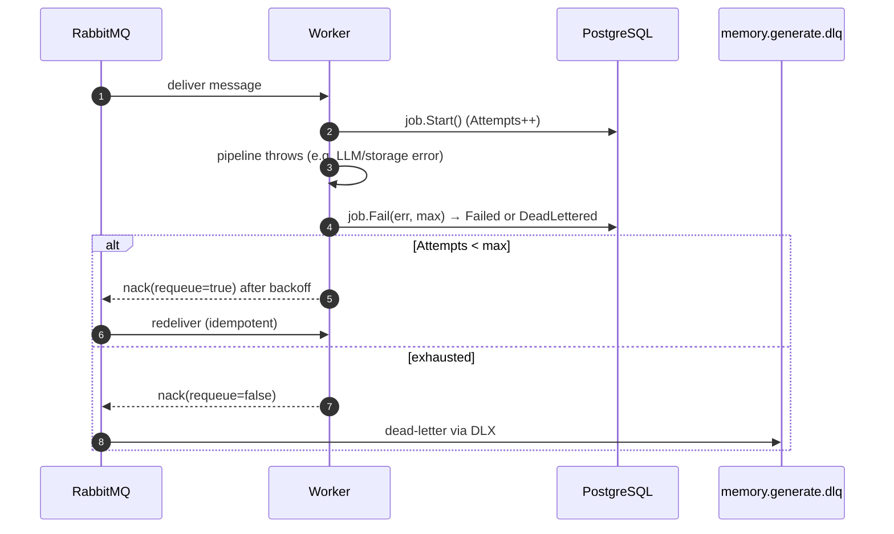
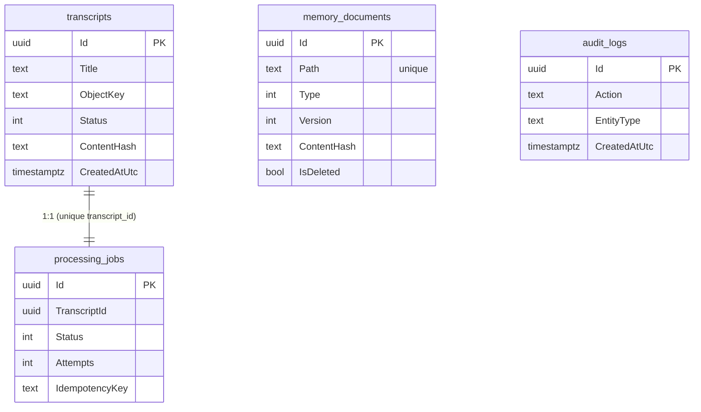

# MemoryWiki — Architecture

## 1. Component diagram

```mermaid
flowchart TB
  subgraph Client
    C[HTTP client / Swagger / demo script]
  end

  subgraph API["MemoryWiki.Api (ASP.NET Core)"]
    AUTH[JWT auth + RBAC + rate limit]
    TE[Transcript endpoints]
    ME[Memory endpoints ls/cat/grep]
  end

  subgraph App["MemoryWiki.Application (CQRS)"]
    CT[CreateTranscript]
    GM[GenerateMemory]
    Q[List/Read/Search queries]
  end

  subgraph Infra["MemoryWiki.Infrastructure"]
    REPO[(EF Core repos)]
    S3A[S3 object storage]
    PUB[RabbitMQ publisher]
    GEN[IGenerationService\nDeterministic | OpenAI]
  end

  subgraph Worker["MemoryWiki.Worker"]
    CON[RabbitMQ consumer\nBackgroundService]
  end

  PG[(PostgreSQL)]
  OS[(MinIO / S3)]
  MQ{{RabbitMQ\nmemory.generate + DLQ}}
  LLM[(LLM provider)]

  C --> AUTH --> TE & ME
  TE --> CT --> REPO --> PG
  CT --> S3A --> OS
  CT --> PUB --> MQ
  MQ --> CON --> GM
  GM --> GEN --> LLM
  GM --> S3A
  GM --> REPO
  ME --> Q --> S3A --> OS
```

## 2. Sequence — transcript ingestion → memory generation

```mermaid
sequenceDiagram
  autonumber
  actor Client
  participant API
  participant DB as PostgreSQL
  participant OS as Object Store
  participant MQ as RabbitMQ
  participant W as Worker
  participant LLM

  Client->>API: POST /api/transcripts (title, file) + JWT
  API->>API: validate (size, content)
  API->>OS: PUT transcripts/{id}.txt
  API->>DB: INSERT transcript(Received→Queued) + job(Pending)
  API->>MQ: publish memory.generate {transcriptId, key, idemKey}
  API-->>Client: 201 { id, status: "Queued" }

  MQ->>W: deliver message (prefetch-bounded)
  W->>DB: load transcript + job (idempotency check)
  alt job already Succeeded
    W-->>MQ: ack (no-op)
  else process
    W->>DB: job.Start(); transcript=Processing
    W->>OS: GET transcripts/{id}.txt
    W->>LLM: ExtractAsync(transcript)  %% pass 1
    loop each entity
      W->>OS: GET existing /people|projects|topics|events/{slug}.md
      W->>LLM: ComposeMarkdownAsync(existing, entity)  %% pass 2 (merge)
      W->>OS: PUT merged markdown (skip if hash unchanged)
      W->>DB: upsert memory_documents (version++)
    end
    W->>DB: transcript=Completed; job.Succeed()
    W->>MQ: publish memory.completed
    W-->>MQ: ack
  end
```

## 3. Sequence — failure, retry & dead-letter



## 4. Memory schema

### Person — `/people/<slug>.md`
```markdown
# Alice
## Summary
Alice is a participant.
## Responsibilities
- Owns the transcript and memory endpoints.
## Meetings
- MemoryWiki Project Kickoff
## Projects
- MemoryWiki Project Kickoff
## Important Decisions
- We will deliver an MVP by 2026-03-01.
## Relationships
- Bob
- Carol
## Open Questions
- How do we handle updates when a new transcript mentions an existing person?
<!-- sources: MemoryWiki Project Kickoff -->
```

### Project / Topic / Event — `/projects/<slug>.md`
```markdown
# MemoryWiki Project Kickoff
## Summary
Memory generated from the conversation "MemoryWiki Project Kickoff" with 3 participant(s).
## Participants
- Alice
- Bob
- Carol
## Timeline
- ... 2026-03-01 ...
## Important Facts
- We agreed to use an S3-compatible object store.
## Decisions
- We will publish a message to RabbitMQ ...
## Open Questions
- And for the async processing?
## Related Topics
- rabbitmq
- storage
<!-- sources: MemoryWiki Project Kickoff -->
```

## 5. Data model (PostgreSQL)



## 6. Messaging topology

```
exchange memorywiki (topic)
  └─ routing key memory.generate ─► queue memory.generate ─(x-dead-letter-exchange)─► memorywiki.dlx
exchange memorywiki.dlx (topic)
  └─ # ─► queue memory.generate.dlq
```

Messages are CloudEvents-shaped (`type`, `source`, `id`, `time`, payload) so other systems
can subscribe to `com.memorywiki.memory.generated`, etc.
